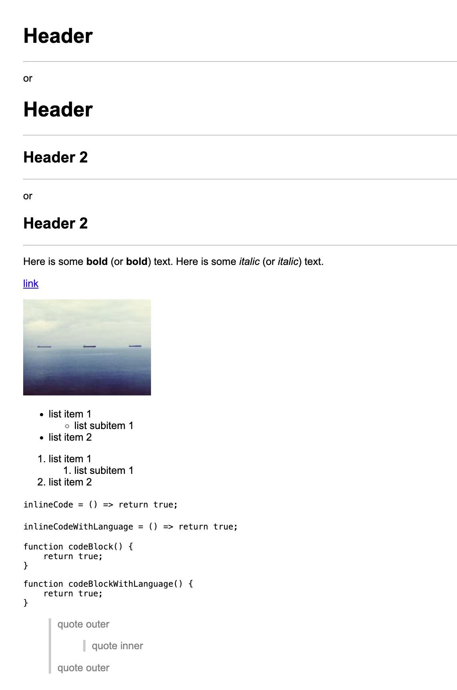

# Markdown Compiler

A Markdown-to-HTML compiler written in Python. This project demonstrates core concepts of compiler construction, including lexical analysis, parsing, syntax transformation, and code generation.

## How It Works

The compiler follows a classic pipeline:

1. Lexer (Tokenizer): Scans the raw Markdown input and produces a list of tokens.
2. Parser: Processes tokens into an abstract syntax tree (AST) representing the document structure.
3. Code Generator: Converts the AST into the target language (HTML).

## Example



## Supported Syntax

- Headers (`#`, `##`, etc.)
- Bold / Italic text
- Ordered and Unordered Lists
- Code Blocks
- Inline Code
- Blockquotes
- Horizontal Rules
- Links & Images

A full example of compiled output can be found in `testdata/example.html`.

## Usage

```python
from compiler import Compiler

Compiler().compile('# Hello world')
# => '<h1>Hello world</h1>'
```

## Setup

```bash
make venv && source .venv/bin/activate
```

## Testing

```bash
make test
```

## Tech

**Python**, **FastAPI**, **Pytest**

## License

MIT
